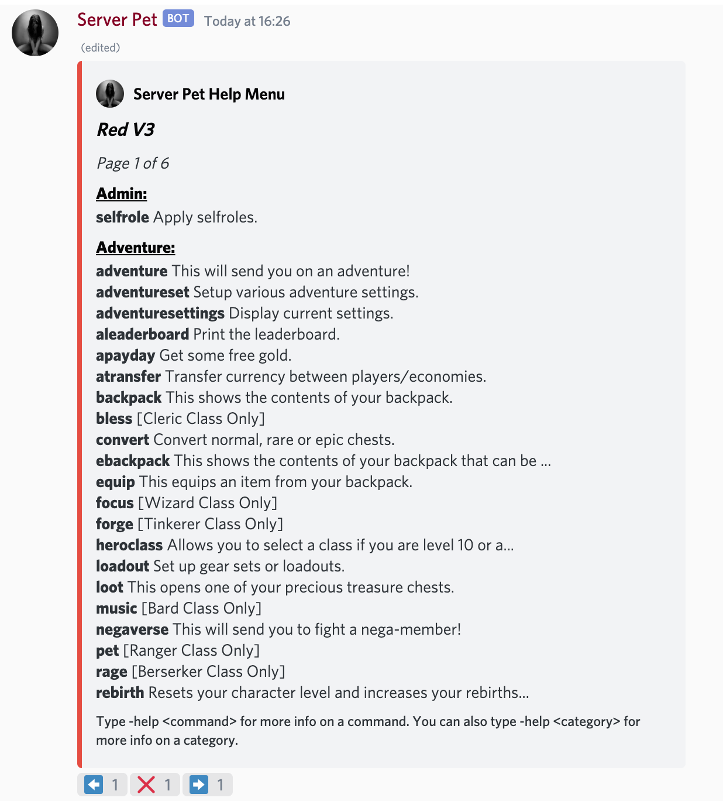
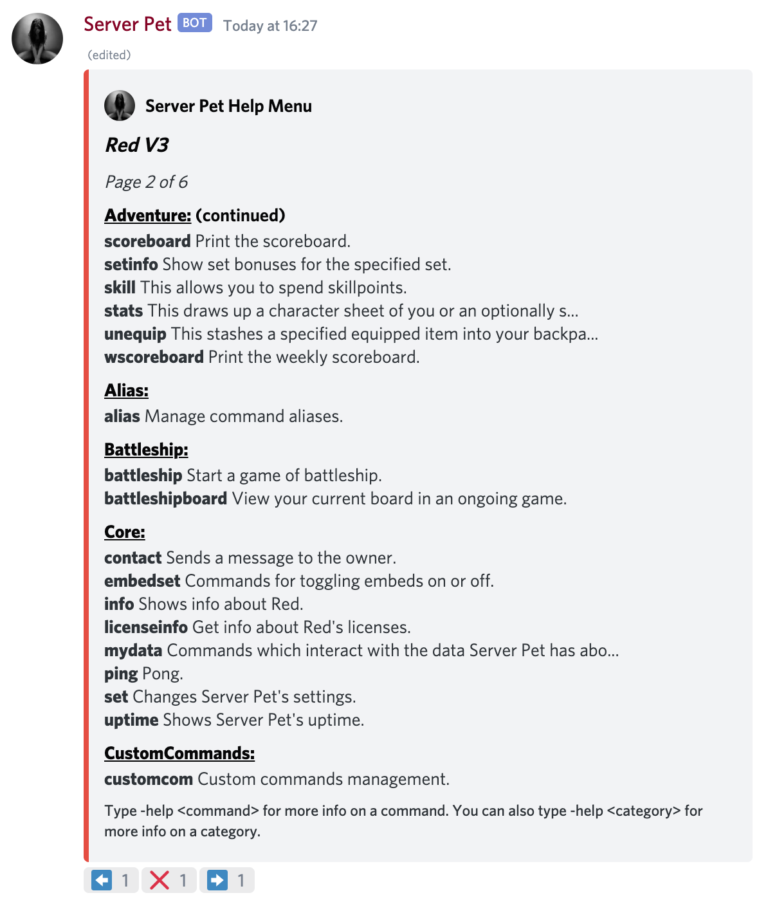
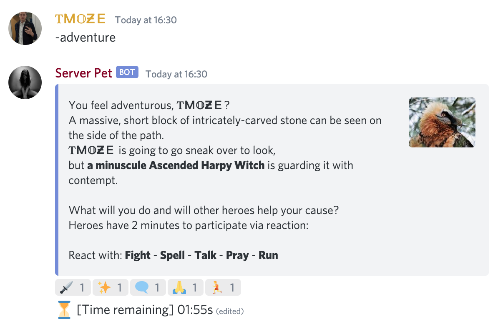
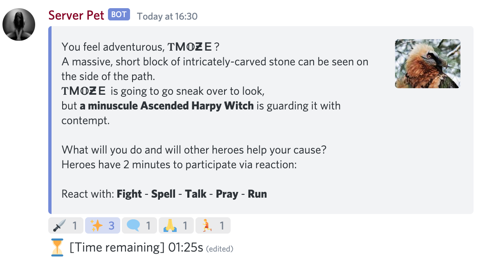
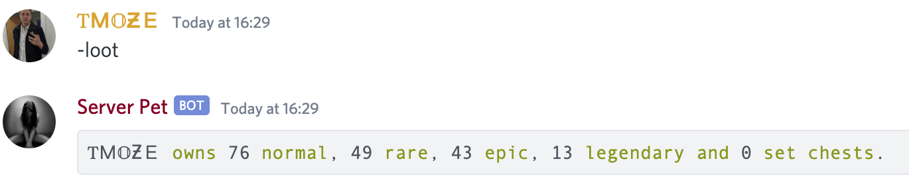
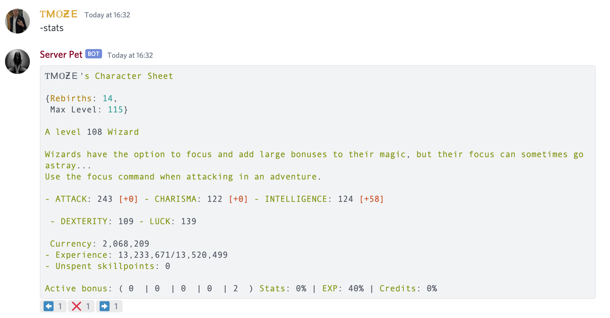
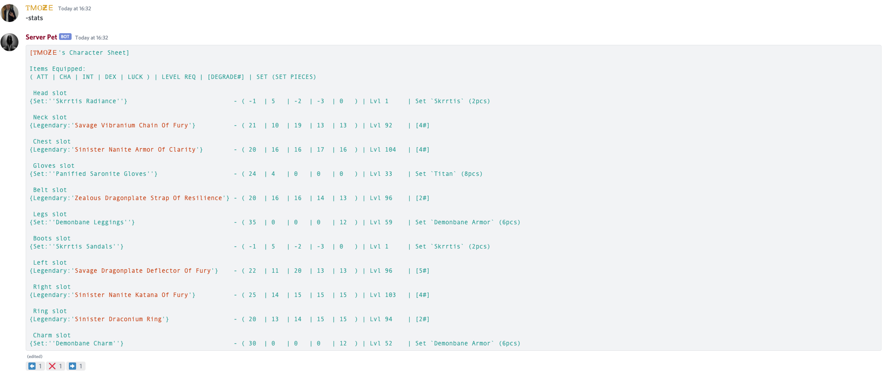
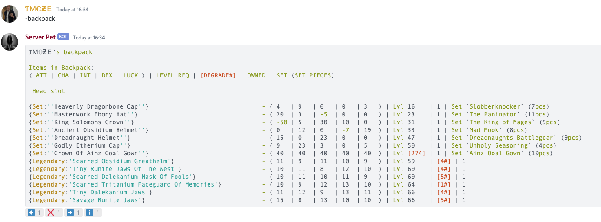

# Getting Started

This is a text-based multiplayer RPG style game. Battle monsters, level up, loot and earn in-game money \(gold\). Join forces with others in Discord and beat those harder monsters.

This guide aims to give you everything you need to start your adventure and kick some ass.

## Rules & Channels 

There are 3 channels that you need to be aware of:

* `#adventure` - This is where the action happens. Keep this channel focused to battling
* `#adv-chat` - Chat with your fellow adventurers. Say hi, ask questions, recruit help for battles etc. Avoid using bot commands in this channel
* `#adv-town` - A channel for bot spam. Use this channel \(along with `#adv-town-2` for all of your adventure related commands\)

_There isn't really a specified SFW or NSFW rule for these channels. Mild nsfw stuff can happen, much like how you can make out in a bar but you'll get kicked out if you try to fuck on the tables._

If you want to see a list of all available commands, type -help in `#adv-town`:

### Notifying other players


**When notifying other players, please be respectful.**


#### Individual notifications

You are allowed to mention individual players for help during a battle, **however you can only do this with their prior consent.**

#### Notify everyone with the "Adventure Time!" \(self-assigned\) role

Some monsters drop additional loot but are often tougher. You'll need to call upon other players to join the battle. To do this, you can ping \(i.e. send a notification\) to everybody who wants to be notified of these battles.

Please **ONLY** do this for the following:

* Bosses \(e.g. a Dragon\). These are monsters with large images and orange text. They can be easily identified by the fact that they raise an alarm and have an extended 5 minute timer
* Anything "Transcended", for example: "_an enlightened_ **Transcended** Troll Berserker**"**

To ping these players, mention the `@Adventure Time!` role in the `#adventure` channel. You can also add a message to provide a bit more context. For example:

`@Adventure Time! Dragon!`


**Only the player who summoned the monster \(a.k.a started the `-adventure` is allowed to use this bot.**

This rule helps ensure that only 1 notification is sent out.


### What an adventure looks like 

To start an adventure, you or somebody else must enter the `-adventure` \(or `-a` for short\) command in the `#adventure` channel. This will start a battle and will look something like this:

You must then use "Reactions" to decide on how to proceed. Tap the icon to select your action. Here, we chose to **Fight \(**Both the sword and starts/spell count as attacks\).

When you're getting started, **Fight** everything unless it is an "**Immortal".** You want to **Talk** to immortals.

Once the timer runs out, the battle ends and the results will be posted automatically.

If you **Win**, you gain XP and in-game money \(gold\). Some monsters also drop loot boxes.

If you **Lose**, it costs you gold.

**For the best chance of success, you want as many people as possible to join the battle by reacting.**

## The Basics 

### Looting 

To make yourself stronger, you can equip items. These are found in loot chests. There are 5 different chest rarities:

* Normal
* Rare
* Epic
* Legendary
* Set

Each chest, when opened, will give you items of that rarity.

To see what loot chests you have, head to `#adv-town` and type `-loot`.

To open a normal loot chest, type `-loot normal`. The new equipment will be added to your backpack.

You can bulk-open multiple chests like so: `-loot normal 10` \(opens 10 normal chests\).

While you are a low level, you're better of selling any legendary items as they are usually for level 80+.

### Equipping items 

Before equipping items, lets have a look at your character's current stats with the `-stats` command:

This will show you everything you need to know about your character. To see what items you currently have equipped \(if any\), press the ➡️ button to go to Page 2:

Here, you can see 10 equipment slots and the items that are currently equipped there. The different colours show what the rarity is.

* Normal: **Green**
* Rare: **Blue**
* Epic: **Orange**
* Legendary: **Teal**
* Set: **White**

Next, lets see what items we have available in our backpack: `-backpack`.

To equip an item, use this command: `-equip`. For example:

`-equip Savage runite jaws` This command does a fuzzy match to save you typing, so you can also type this for the same outcome:

`-equip runite jaws`

### Rebirthing once you reach max level 

Now you know the basics of battle, you should be able to start levelling up. Once you reach **Level 5**, you will need to **"Rebirth"** before you can level up any more.

To rebirth, head to the `#adv-town` channel and type `-rebirth`. This will:

* Reset your level back to level 1
* Increase your maximum level \(to 25 in this case\)
* Empty your backpack of any items you have looted \(except for legendary items and sets - see the Backpack guide for more details\)
* Cost 100% of your gold
* Cost all of your current gear
  * Legendary items last 3 rebirths
  * Set items never disappear

In turn, rebirthing will give you a higher stat base, a better chance for acquiring more powerful items, a higher max level, and the ability to convert chests to higher rarities after the second rebirth.

**You will want to rebirth whenever you reach your maximum level.**

If you have a lot of gold, send it to another player to hold for you while you rebirth. They can transfer it back to you afterwards and it avoids you losing all of your gold.

To do this, head to `#adv-town` and type `-bank balance` to see how much gold you have. Then to transfer it, use: ``-bank transfer @username 1000`.``

It is also worth selling all of your equipment too, as your backpack gets emptied. Typically it is best to sell everything **other than your sets**. You can sell equipment like so:

* `-backpack sellall normal`
* `-backpack sellall rare`
* `-backpack sellall epic`
* `-backpack sellall legendary`

If you don't have any sets, you can just sell everything with `-backpack sellall`.

### Picking a Class \(Level 10+\) 

Once you have reached level 10, you get to pick a class for your character. Each class has different strengths and abilities. The available classes are:

* Tinkerer
* Berserker
* Wizard
* Cleric
* Ranger
* Bard

For more in-depth information on each of these, head over to the **Classes** page:

To select a class, head to `#adv-town` and use the command:

`-heroclass`

So, if you wanted to be a Berserker you can type:

`-heroclass berserker`

